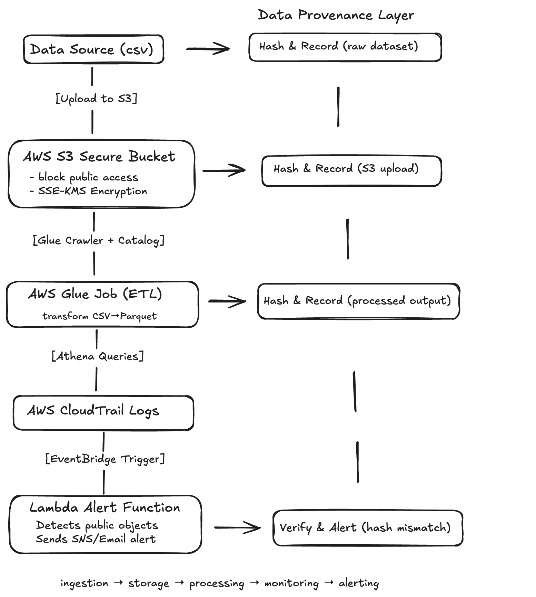

# Secure Data Pipeline on AWS
This project demonstrates how to build and secure a small data pipeline using AWS S3, Glue, and Athena with defense-in-depth principles like encryption, monitoring, and automated alerts.

## Folder Structure
- `data/` — sample dataset for ingestion
- `glue_jobs/` — ETL scripts
- `lambda/` — monitoring and alerting functions
- `terraform/` — optional IaC setup
- `docs/` — documentation and security notes

## Architecture Diagram

## Setup

## Security Controls
