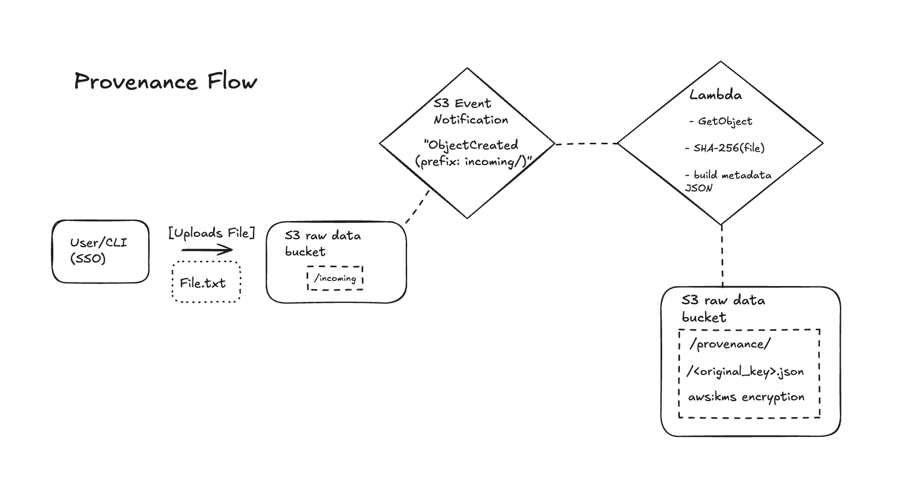

# Secure Data Pipeline Runbook

## Overview
Goal: establish a secure baseline pipeline that logs and audits all S3 activity.

### Components
- **S3:** versioning + SSE-KMS enabled
- **CloudTrail**: Logs S3 data events into `caa304-cloudtrail-log`
- **Athena:** Queries CloudTrail logs for auditing
- **IAM Identity Center**: SSO auth for CLI
---

## Phase 1 — S3 + CloudTrail and Secure CLI Setup
### Steps
1. **Architecture diagram**
1. **Created buckets:**
   - caa304-raw-data (versioned, SSE-KMS)
   - caa304-cloudtrail-log
2. **Verified CloudTrail** logging (PutObject, GetObject events)
3. **Created Athena** table + flattened view.
4. **Connected** to AWS CLI via SSO auth to create a logical folder prefix inside raw data bucket. These prefixes act as    folders for data orgination and for ETL tools.
5. **Uploaded a test file** to validate access, encryption and event logging set up.
6. **Upload succeeded**, confirming that: sso-based CLI access works correctly, the bucket automatically applies KMS encrytion and that CloudTrail logs the PutObject event for later verification in Athena.
7. **Validated** in Athena


### Key Commands

```bash
# Create prefixes ("folders")
aws s3api put-object --bucket caa304-raw-data --key incoming/
aws s3api put-object --bucket caa304-raw-data --key processed/
aws s3api put-object --bucket caa304-raw-data --key test/

### Athena Validation
SELECT eventTime, eventName, user_arn, bucket_name, object_key
FROM cloudtrail_s3_events_flattened
WHERE bucket_name='caa304-raw-data'
  AND eventName='PutObject'
ORDER BY eventTime DESC;
```


### How It Works
S3 now recognizes a structured location for raw data uploads. Test proves that every object is encrypted at rest with my KMS key. Bucket-level key optimization is active (efficient, secure encryption). All operations used temporary, MFA-protected credentials, so no long-lived keys. Provides a known “good” test case for Athena queries and future Lambda integrity checks.

## Up next:
Add a Lambda that checks every new S3 file by computing a SHA-256 hash and saving it as a provenance record to verify the file's integrity over time.

## 11/25/2025:
## Phase 2 — Lambda Provenance

This Lambda function is triggered whenever a new file is added to my S3 bucket under the configured prefix. The S3 event tells the function which bucket the operation happened in and the full path (key) of the file that was uploaded.

Lambda then downloads the file so that it has the contents in memory and can work with the actual data, not just the file name. It computes a SHA-256 hash to create a fingerprint of the file’s contents, which will change if the file is altered in any way.

Then the function builds a provenance record in JSON format. This record includes metadata such as the bucket name, the object key, the content length, the S3 last-modified time, and a timestamp for when Lambda recorded the provenance. This JSON acts like a “receipt” proving the state of the file at the moment it arrived.

Lambda stores this provenance JSON in a `provenance/` folder. This keeps provenance records separate from raw data while preserving a similar folder structure, making it easy to look up the integrity record for any given file.

To avoid an infinite loop, the function checks whether the key starts with `provenance/`. If it does, Lambda skips processing that object, so it doesn’t try to hash and rewrite its own provenance JSON files over and over.

I forgot about IAM permissions here, so it took a bit longer to wire up, but it works.

------------------------------------------------------------

### Provenance Flow

This diagram illustrates the provenance workflow for raw file ingestion.
Whenever a new object is uploaded to the `incoming/` prefix of the raw data
bucket, S3 sends an `ObjectCreated` event that triggers the
`secure-provenance-lambda` function.

The Lambda retrieves the file, computes a SHA-256 fingerprint, builds a
provenance metadata record, and writes a JSON file to the
`provenance/` prefix.




See: `diagrams/provenance-flow.png`

## 12/04/2025:
## Phase 3 — Data Capture in CloudTrail + Athena
For every S3 PutObject into the raw layer, CloudTrail logs events and we pull from it in Athena.
This allows us to capture all the metadata for every S3 PutObject.
In Athena we created a table from the metadata that the Lambda outputs and combined it with the CloudTrail events table to create
one unifued view of the whole end-to-end provenance process in provenance_ledger. Gives us the who, what, when and where of all files.
Had an issue with Athena table location, originally it was pointing to one single data directory, giving stale data. Updated CloudTrail
ensuring all S3 event-level objects in the folder were being captured.
