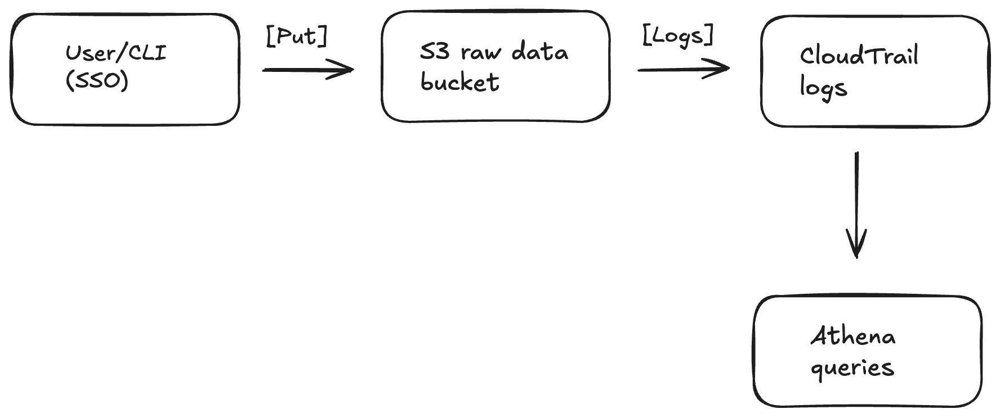

# Secure Data Pipeline Runbook

## Overview
Goal: establish a secure baseline pipeline that logs and audits all S3 activity.

### Components
- **S3:** versioning + SSE-KMS enabled
- **CloudTrail**: Logs S3 data events into `caa304-cloudtrail-log`
- **Athena:** Queries CloudTrail logs for auditing
- **IAM Identity Center**: SSO auth for CLI
---

## Phase 1 — S3 + CloudTrail and Secure CLI Setup
### Steps
1. **Architecture diagram**
1. **Created buckets:**
   - caa304-raw-data (versioned, SSE-KMS)
   - caa304-cloudtrail-log
2. **Verified CloudTrail** logging (PutObject, GetObject events)
3. **Created Athena** table + flattened view.
4. **Connected** to AWS CLI via SSO auth to create a logical folder prefix inside raw data bucket. These prefixes act as    folders for data orgination and for ETL tools.
5. **Uploaded a test file** to validate access, encryption and event logging set up.
6. **Upload succeeded**, confirming that: sso-based CLI access works correctly, the bucket automatically applies KMS encrytion and that CloudTrail logs the PutObject event for later verification in Athena.
7. **Validated** in Athena



### Key Commands

```bash
# Create prefixes ("folders")
aws s3api put-object --bucket caa304-raw-data --key incoming/
aws s3api put-object --bucket caa304-raw-data --key processed/
aws s3api put-object --bucket caa304-raw-data --key test/

### Athena Validation
SELECT eventTime, eventName, user_arn, bucket_name, object_key
FROM cloudtrail_s3_events_flattened
WHERE bucket_name='caa304-raw-data'
  AND eventName='PutObject'
ORDER BY eventTime DESC;
```


### “How It Works”
S3 now recognizes a structured location for raw data uploads. Test proves that every object is encrypted at rest with my KMS key. Bucket-level key optimization is active (efficient, secure encryption). All operations used temporary, MFA-protected credentials, so no long-lived keys. Provides a known “good” test case for Athena queries and future Lambda integrity checks.

## Up next:
Add a Lambda that checks every new S3 file by computing a SHA-256 hash and saving it as a provenance record to verify the file's integrity over time.